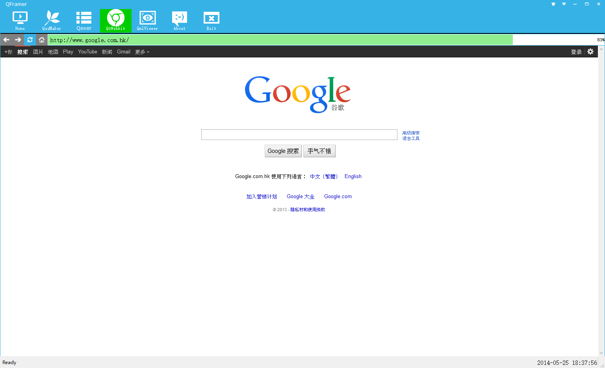
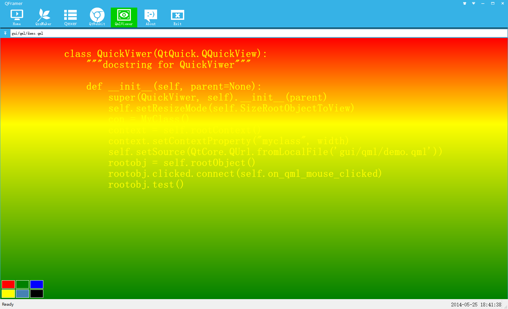
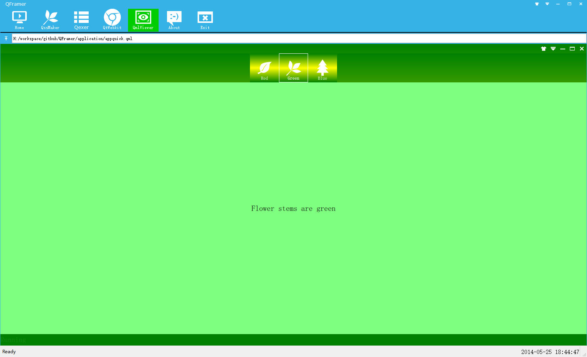
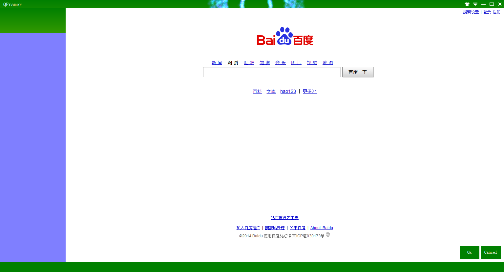
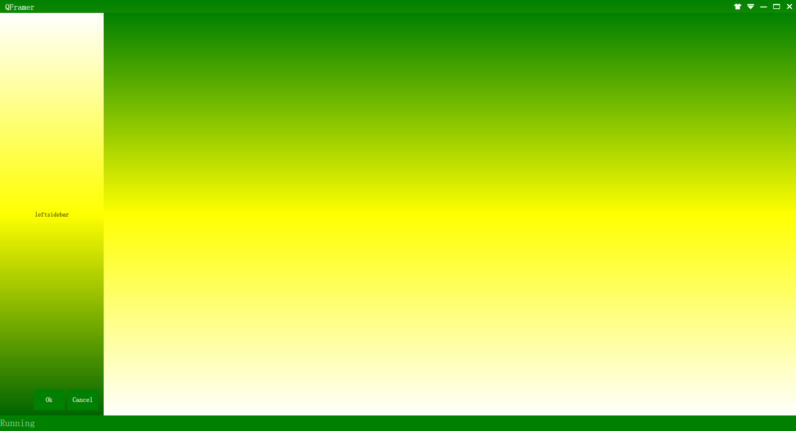
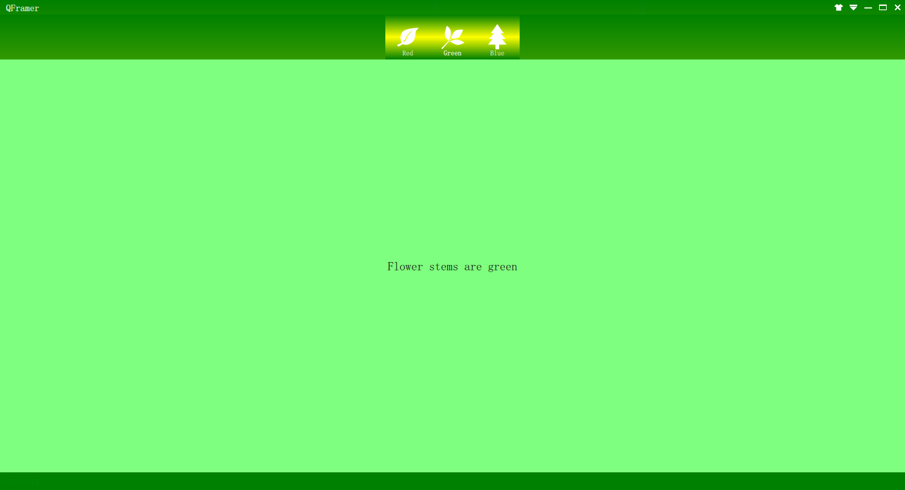
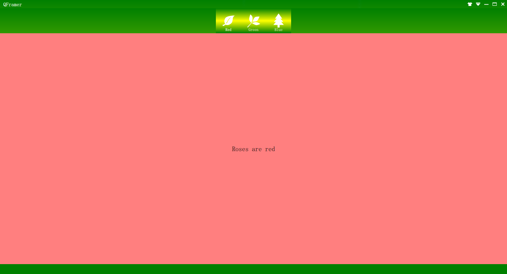

QFramer 是基于PyQt5的一款快速开发框架
====================================
####1. 基于Qt/ PyQt /PySide开发GUI常用的开发方式
+ ``QWidget + qss``
+ ``QtWebkit + html + css + js``
+ ``Qt Quick``
**这三种技术都可以高效、快速、完美的开发出你所需要的跨平台桌面软件**
目前Qt官方主推的开发方式为``Qt Quick``，采用类json的语言qml进行快速开发，上手容易，功能强大，Ubutun、Linux Deepin等Linux桌面开发团队都在积极使用qml进行桌面开发, 相信qml能在桌面开发走的长远。

####2.什么是QFramer?
> 得益于Qt的强大和Python的高度开发效率，使用PyQt/PySide进行桌面开发将是一场美妙体验。正因为如此,笔者开发了一套基于PyQt5的快速开发框架QFramer，方便快速搭建框架原型，把更多的精力放大相应的业务逻辑上。

开发环境：Python3.5 + PyQt5 + cx_Freeze
**QFamer**提供了两种开发模式
+ **混合模式**： 混合``QWiget + qss + QtWebkit + html + css + js + Qt Quick``,利用``Qwidget``原生控件搭建外层框架，``QtWebkit``和``QtQuick``作为内嵌模块，无所不能...
+ **qml模式**： 单独使用``QtQuick``技术，利用``qml + js + QQuickView``进行开发，界面全部使用qml书写

####3. QFramer之``混合模式``
+ QWidget

+ QtWebkit

+ QtQuick

####4. **QFamer之``qml模式``**
+ 示例1

+ 示例2

+ 示例3

+ 示例4

+ 示例5

####5.运行软件
``QFramer`` ``Github``地址:https://github.com/dragondjf/QFramer

        git clone https://github.com/dragondjf/QFramer

目前支持python2.7和python3.3

PyQt5-5.2-gpl-Py2.7-Qt5.2.0-x32 下载地址：http://pan.baidu.com/s/1kTl0Qbl
PyQt5-5.2-gpl-Py3.3-Qt5.2.0-x32 下载地址：http://pan.baidu.com/s/1fD8a6
``混合模式``： 
               
        python2.7 setup_py2.7.py
        python3.3 setup_py3.3.py
``qml模式``：  

        python2.7 setup_qml_py2.7.py
        python3.3 setup_qml_py3.3.py

####6.window下软件获取及打包软件发布

``混合模式``： 
               
        python setup.py
``qml模式``：  

        python setup_qml.py

####7.欢迎拍砖，希望再一次得到提速
+ **QFramer** ``Github项目地址``:https://github.com/dragondjf/QFramer
+ QQ: 465398889
+ email: ``dragondjf@gmail.com`` or ``ding465398889@163.com``
+ 如果有一点点帮助到你了，``It's my pleasure!``；如果有什么不足，欢迎指正；如果这个框架可以一起开发完善，请联系我，谢谢！
